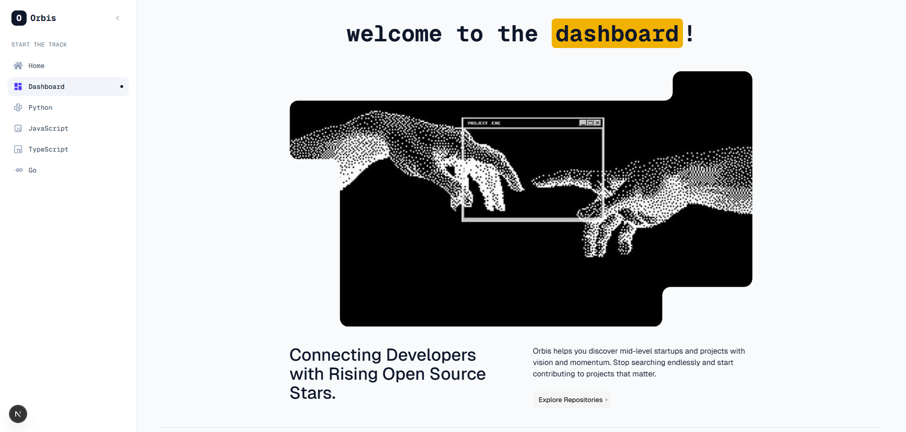
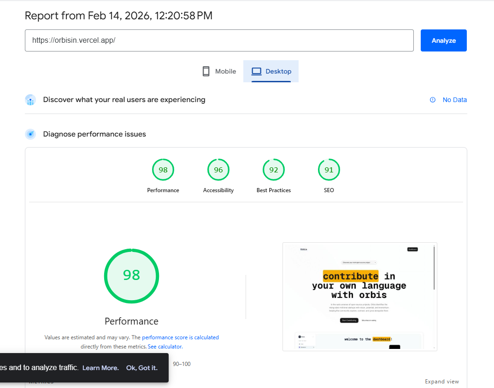

# Orbis - SSR Website Assessment


## Project Overview
Orbis is a server-side rendered (SSR) React-based website built using Next.js. This project is designed to be SEO-optimized, featuring programmatic SEO pages generated dynamically based on external data. The application adheres to modern web development best practices, including the use of JSON-LD schema, OpenGraph metadata, and responsive design.

## Features

- Server-Side Rendering (SSR): Ensures content is pre-rendered on the server for optimal SEO performance and fast initial load times.
- Programmatic SEO: Dynamic creation of pages based on data, targeting relevant keywords.
- SEO Best Practices: Implementation of semantic HTML, meta tags, and structured data (JSON-LD).
- Responsive Design: Mobile-friendly interface built with Tailwind CSS and Radix UI components.
- Dynamic Data Integration: Fetches implementation data using GitHub API.

## Prerequisites

Ensure you have the following installed on your local machine:

- Node.js (v18 or higher recommended)
- npm or yarn

## Local Setup

Follow these steps to set up and run the project locally:

1. Clone the repository

   ```bash
   git clone <repository-url>
   cd orbis
   ```

2. Install dependencies

   ```bash
   npm install
   ```

3. Configure Environment Variables

   Create a .env.local file in the root directory and add your GitHub Token:

   Open .env.local and populate the GITHUB_TOKEN variable:

   ```text
   GITHUB_TOKEN=your_github_personal_access_token
   ```

4. Run the development server

   ```bash
   npm run dev
   ```

   Open http://localhost:3000 with your browser to see the result.

## Project Structure

- src/app: App directory containing pages and layouts.
- src/components: Reusable React components.
- public: Static assets.
- styles: Global styles and Tailwind configuration.

## Tech Stack

- Framework: Next.js 16
- Language: TypeScript
- Styling: Tailwind CSS, PostCSS
- Components: Radix UI, Lucide React, Framer Motion
- Linter: ESLint

## Deployment

The application is designed to be deployed on cloud platforms like Vercel or Netlify.

## Assessment Scope

This project addresses the following assessment tasks:

1. Project Setup: Set up Next.js for SSR and SEO optimization.
2. Data Selection: Utilization of GitHub data for programmatic pages.
3. SEO Optimization: Implementation of meta tags, titles, JSON-LD, and OpenGraph.
4. Programmatic SEO: Dynamic generation of at least 3 SEO-friendly pages using server-side data fetching.
5. Design: Clean, responsive UI with accessibility considerations.
6. Deployment: Hosting on Vercel/Netlify.
7. Testing: Verification of SEO scores and rendering performance.

